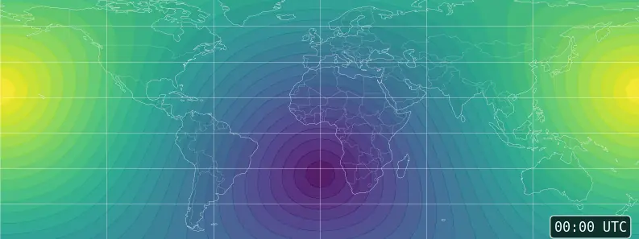

# solarpos

A command-line application to calculate topocentric solar coordinates and sunrise/sunset times, based
on [solarpositioning](https://github.com/klausbrunner/solarpositioning), a library of high-quality solar
positioning algorithms. Supports time series, coordinate ranges, and output formats like JSON and CSV for easy scripting and processing by other tools.



*Animation showing global solar elevation throughout summer solstice 2026, demonstrating solarpos's geographic sweep and time series capabilities. All ~100k data points were generated from a single solarpos command.*

## Requirements and installation

Solarpos is a Java application, requiring a Java 21 or newer runtime. See the [latest release](https://github.com/klausbrunner/solarpos/releases/latest) or build from source using `mvn package`. 

The application artifact is a single JAR file that requires no "installation". The release archive bundles this with shell scripts for simple usage, though.

If you're unsure how to get a Java runtime for your system, [Adoptium](http://adoptium.net/) is recommended.

### Native builds

Native builds are available for some common platforms. These do not require a Java runtime and consist of a single, stand-alone executable that can be used as is.

### macOS: Homebrew installation

A [Homebrew](https://brew.sh) formula for solarpos is available in a separate tap. This simplifies installation to one command:

```shell
brew install klausbrunner/tap/solarpos-native
```

Use ``klausbrunner/tap/solarpos`` if there's no native build for your hardware architecture. This will install the Java version of solarpos, automatically downloading a Java runtime if needed.

## Usage

For detailed usage, see built-in help.

```text
Usage: solarpos [-hV] [--headers] [--[no-]show-inputs] [--deltat[=<deltaT>]]
                [--format=<format>] [--timezone=<timezone>] <latitude>
                <longitude> <dateTime> [COMMAND]
Calculates topocentric solar coordinates or sunrise/sunset times.
      <latitude>            Latitude in decimal degrees, range (start:end:
                              step), or @file with coordinates.
      <longitude>           Longitude in decimal degrees, range (start:end:
                              step), or @file with coordinates.
      <dateTime>            Date/time in ISO format yyyy[-MM[-dd[['T'][ ]HH:mm[:
                              ss[.SSS]][XXX['['VV']']]]]], or @file with times.
                              Use 'now' for current time and date.
      --deltat[=<deltaT>]   Delta T in seconds; an estimate is used if this
                              option is given without a value.
      --format=<format>     Output format, one of HUMAN, CSV, JSON.
  -h, --help                Show this help message and exit.
      --headers             Show headers in output (CSV only).
      --[no-]show-inputs    Show all inputs in output. Automatically enabled
                              for coordinate ranges unless --no-show-inputs is
                              used.
      --timezone=<timezone> Timezone as offset (e.g. +01:00) and/or zone id (e.
                              g. America/Los_Angeles). Overrides any timezone
                              info found in dateTime.
  -V, --version             Print version information and exit.
Commands:
  help      Display help information about the specified command.
  position  Calculates topocentric solar coordinates.
  sunrise   Calculates sunrise, transit, sunset and (optionally) twilight times.
```

### Time series

There is built-in support for calculating time series.

* If you pass only a year (e.g. 2023) or a year-month (e.g. 2023-01) to the sunrise command, you will get results for
  each day of that year or month.
* Similarly, the position command will calculate a time series of sun positions for the given day, month or even year.
  The interval is determined by the `--step` option (default: 1 hour).

### Geographic sweeps

In addition to time series, solarpos supports geographic coordinate ranges for calculating solar positions across multiple locations simultaneously.

* Use the range syntax `start:end:step` for latitude and/or longitude parameters to define a geographic grid
* For example, `40.0:45.0:0.5` generates coordinates from 40.0° to 45.0° in 0.5° increments
* This works with both positive and negative coordinates (e.g., `-10.0:-5.0:1.0` for southern latitudes or western longitudes)
* Geographic sweeps can be combined with time series for comprehensive spatial-temporal analysis

### File input

For advanced use cases, solarpos supports reading coordinates and times from files using the `@filename` syntax:

* **Coordinate files**: Use `@coords.txt` as the latitude parameter to read coordinates from a file, one coordinate pair per line in "latitude longitude" format
* **Time files**: Use `@times.txt` as the dateTime parameter to read times from a file, one timestamp per line  
* **Paired data files**: Use `@data.txt now` to read coordinate-time pairs from a file, with "latitude longitude datetime" on each line
* **Stdin input**: Use `@-` to read data from stdin instead of a file. Only one parameter can use stdin at a time.

Coordinate files and time files create a cartesian product - every coordinate is calculated for every time. Paired data files contain explicit coordinate-time pairs with no cartesian expansion.

File formats support comments (lines starting with `#`) and blank lines, which are ignored. Both space-separated and CSV formats are accepted. Examples:

```text
# Coordinate file (coords.txt)
40.417 -3.704  # Madrid
48.856  2.349  # Paris
52.520 13.405  # Berlin

# Time file (times.txt)
2026-06-21T06:00:00
2026-06-21T12:00:00
2026-06-21T18:00:00

# Paired data file (data.txt) - space-separated
40.417 -3.704 2026-06-21T12:00:00  # Madrid at noon
48.856  2.349 2026-06-21T13:00:00  # Paris at 1pm

# Paired data file (data.csv) - CSV format  
40.417,-3.704,2026-06-21T12:00:00
48.856,2.349,2026-06-21T13:00:00
```

Usage examples:
```shell
# Calculate positions for multiple coordinates at the same time
solarpos @coords.txt 2026-06-21T12:00:00 position

# Calculate positions for one location at multiple times
solarpos 40.417 -3.704 @times.txt position

# Calculate positions for coordinate-time pairs
solarpos @data.txt position

# Pipe data from stdin using @- syntax
echo "52.0,25.0,2023-06-21T12:00:00" | solarpos @- position
cat coords.txt | solarpos @- 2023-06-21T12:00:00 position
generate-times | solarpos 52.0 25.0 @- position
```

### Date and Time Formats

Dates and times should be given in ISO 8601 format like "2011-12-03T10:15:30+01:00" or an unambiguous subset, such as:

* "2025-12-03" for a local date (timezone is taken from the timezone parameter if available, else the system default is used)
* "11:00" for a local time (today's date is assumed, timezone is determined as above)
* "14:00:13.312Z" for a UTC time (today's date is assumed, timezone is UTC unless overridden by the timezone parameter)

### Timezones

Timezones may be specified as part of the time specification or with the separate `--timezone` parameter. The format variants are:

* A fixed offset specified in hours and minutes, e.g. "-03:00".
* The "Z" shorthand for UTC (fixed zero offset).
* A TZ database name, such as "Asia/Singapore" (see the [Wikipedia article](https://en.wikipedia.org/wiki/List_of_tz_database_time_zones) for a full list). If one of these is used, daylight savings time (if any) will be applied automatically according to the location's rules.

### Delta T

The difference between universal and terrestrial time affects all solar position calculations. This is an observed value that cannot be reliably predicted into the (far) future, but past values are known at least for the last few centuries and decent estimates can be given for the next few years. Use the `--deltat` option without a value to request such an estimate. See the documentation of [solarpositioning](https://github.com/klausbrunner/solarpositioning) for more detail.

### Output formats

The tool supports three output formats selectable with the `--format` parameter:

* `human`: Default. Simple text output for, well, humans. Most useful for single values.
* `csv`: The popular comma-separated values format, most useful for time series output and processing in various tools. Use the `--headers` parameter to add a header row.
* `json`: JSON, or more precisely JSON Lines (one object on each line, without an enclosing array).

### Usage examples

Get today's sunrise and sunset for Madrid, Spain, in UTC:

```shell
solarpos 40.417 -3.704 now --timezone UTC sunrise
```

Get the sun's position in Stockholm, Sweden, on 15 January 2026 at 12:30 Central European Time:

```shell
solarpos 59.334 18.063 2026-01-15T12:30:00+01:00 position 
```

Get a time series of sun positions for Berlin, Germany, on 26 March 2023, one position every 10 minutes, with CSV
output, in local timezone and using a delta T estimate. As the transition to DST happens on this day, you'll see the changed offset in the data.

```shell
solarpos 52.522 13.413 2023-03-26 --timezone Europe/Berlin --deltat --format=csv position --step=600
```

Get a full calendar of sunrise/sunset and twilight times for Mumbai, India for the year 2027 assuming a delta T of 69 seconds, in JSON lines format. Use the local timezone, which is Asia/Kolkata as per the tz database.

```shell
solarpos 18.97 72.83 2027 --timezone Asia/Kolkata --deltat=69 --format=json sunrise --twilight
```

Calculate solar positions across a geographic grid covering Central Europe (45°N to 50°N, 5°E to 15°E) with 1° resolution at noon on the summer solstice:

```shell
solarpos 45.0:50.0:1.0 5.0:15.0:1.0 2026-06-21T12:00:00Z --format=csv position
```

Get sunrise times for a transect across South America (10°S to 30°S latitude at 60°W longitude) for the entire month of March 2028:

```shell
solarpos -30.0:-10.0:2.0 -60.0 2028-03 --timezone America/Sao_Paulo --format=csv sunrise
```

Sample R notebooks demonstrating how to use `solarpos` output to create diagrams can be found at [klausbrunner/sunpath-r](https://github.com/klausbrunner/sunpath-r).
